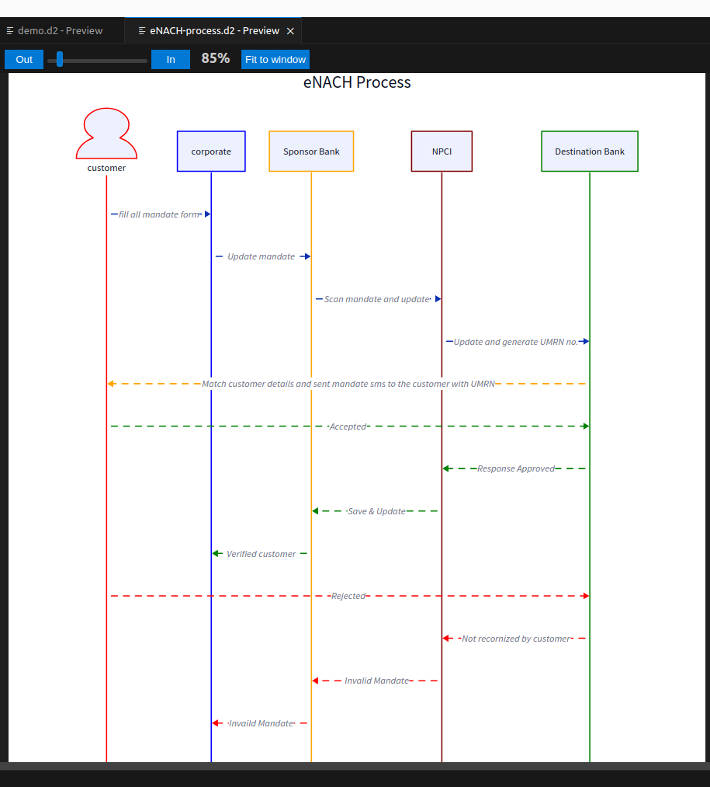
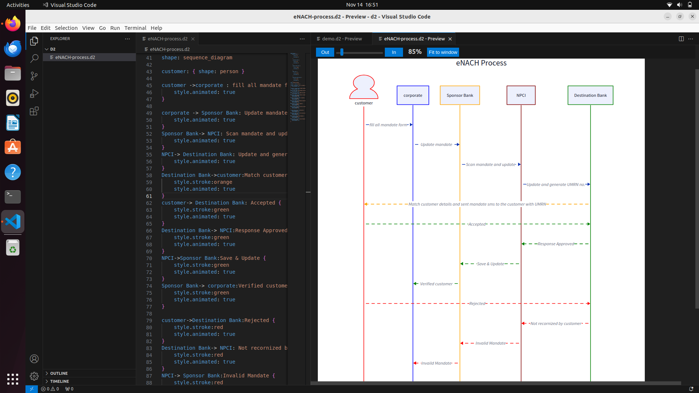
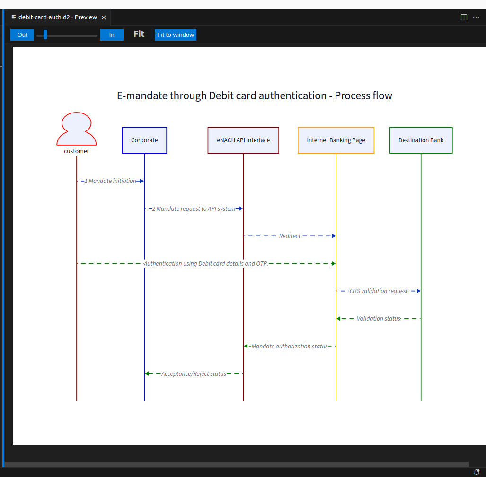
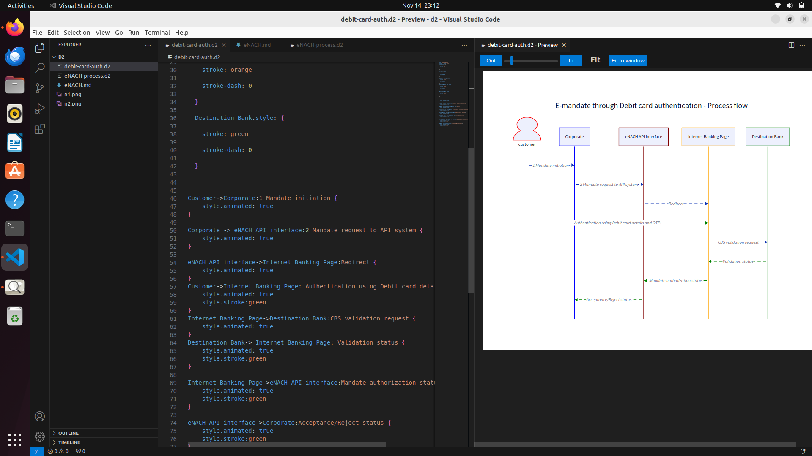

# NACH (National Automated Clearing House)

NACH is a web-based and automated procedure platform which was created by NPCI (National payments corporation of India) in 2016 to facilitate funds clearing.

NACH Credit and NACH Debit are electronic systems for handling high-volume, recurring interbank transactions, whether they involve high or low amounts of money.

Its aim is to facilitate high volume transactions.

## Objective of NACH

The main objective of NACH are as follow:

* Supports Mobile-based and Aadhaar-based Automated clearing house transactions.
* It operates as a centralised system for multiple ECS systems.
* It is capable of managing large number of repetitive transactions
* The Regulations to be followed by the user are easy to comprehend and follow.

## Workflow of eNACH

NACH (National Automated Clearing House) is a simpler and faster process of automated  bulk transactions.

Here is steps of NACH how it works:

**Step 1:** Mandates initiation by the Customer to the Corporate.

**Step 2:** Corporate update the progress and send it to the Sponsor Bank.

**Step 3:** At the Sponsor Bank office all mandates are updated and sent to the NPCI.

**Step 4:** NPCI scanned the mandated images and generated the UMRN then to the Destination Bank via NPCI with UMRN No.

**Step 5:** Destination Bank firstly checks the details given by the NPCI if details matched then it sends the verification mandates to the customer and updates the records.

**Step 6** If the Customer accepts the request then the Destination Bank shares the response approved.

**Step 7** NPCI save and update the details then share the response to the Sponsor Bank.

**Step 8** Sponsor Bank share the response Verified customer  to the Corporate

**Step 9** If Customer reject the request the the Destination Bank share the response eMandate not recognized by the customer to the NPCI

**Step 10** NPCI share the response eMandate not recognized by customer to the Sponsor bank 

**Step 11** Sponsor Bank shares the response Invalid user to the Corporate.

~~~
eNACH Process {
   customer.style: {

       stroke: red
      
       stroke-dash: 0
    
     }

     corporate.style: {

       stroke: blue
    
       stroke-dash: 0
    
     }

     Sponsor Bank.style: {

       stroke: orange
    
       stroke-dash: 0
    
     }

     NPCI.style: {

       stroke: maroon
    
       stroke-dash: 0
    
     }

     Destination Bank.style: {

       stroke: green
    
       stroke-dash: 0
    
     }
shape: sequence_diagram

customer: { shape: person }

customer ->corporate : fill all mandate {
   style.animated: true
}

corporate -> Sponsor Bank: Update mandate {
   style.animated: true
}
Sponsor Bank-> NPCI: Scan mandate and generate UMRN {
   style.animated: true
}
NPCI-> Destination Bank: Update with UMRN no. {
   style.animated: true
}
Destination Bank->customer:Match customer details and sent mandate sms to the customer with UMRN {
   style.stroke:orange
   style.animated: true
}
customer-> Destination Bank: Accepted {
   style.stroke:green
   style.animated: true
}
Destination Bank-> NPCI:Response Approved {
   style.stroke:green
   style.animated: true
}
NPCI->Sponsor Bank:Save & Update {
   style.stroke:green
   style.animated: true
}
Sponsor Bank-> corporate:Verified customer {
   style.stroke:green
   style.animated: true
}

customer->Destination Bank:Rejected {
   style.stroke:red
   style.animated: true
}
Destination Bank-> NPCI: Not recornized by customer {
   style.stroke:red
   style.animated: true
}
NPCI-> Sponsor Bank:Invalid Mandate {
   style.stroke:red
   style.animated: true
}
Sponsor Bank-> corporate:Invaild Mandate {
   style.stroke:red
   style.animated: true
}
}
~~~

## E-mandate through Debit card authentication - Process flow

~~~
E-mandate through Debit card authentication - Process flow: {
shape: sequence_diagram
customer: { shape: person }
customer.style: {

    stroke: red
    
    stroke-dash: 0
  
  }

  Corporate.style: {

    stroke: blue
    
    stroke-dash: 0
  
  }

  eNACH API interface.style: {

    stroke: maroon
    
    stroke-dash: 0
  
  }

  Internet Banking Page.style: {

    stroke: orange
    
    stroke-dash: 0
  
  }

  Destination Bank.style: {

    stroke: green
    
    stroke-dash: 0
  
  }

  

Customer->Corporate:1 Mandate initiation {
    style.animated: true
}

Corporate -> eNACH API interface:2 Mandate request to API system {
    style.animated: true
}

eNACH API interface->Internet Banking Page:Redirect {
    style.animated: true
}
Customer->Internet Banking Page: Authentication using Debit card details and OTP. {
    style.animated: true
    style.stroke:green
}
Internet Banking Page->Destination Bank:CBS validation request {
    style.animated: true
}
Destination Bank-> Internet Banking Page: Validation status {
    style.animated: true
    style.stroke:green
}

Internet Banking Page->eNACH API interface:Mandate authorization status {
    style.animated: true
    style.stroke:green
}

eNACH API interface->Corporate:Acceptance/Reject status {
    style.animated: true
    style.stroke:green
}

}
~~~

## Fino Payment bank

**Fino Payment Bank** is also like any other bank but operates on a smaller scale involving any credit risk.

It accepts deposits up to **1 lakhs**.

It offers remittance services like **Mobile payment, transfer, purchase** and other banking services like ATM Debit cards, Netbanking and third party fund transfer.

### Fino Product 

**Saving Account**

Fino payment banks offers 8 type of saving account are as follow:

* FinoPay Savings Account
* Subh Savings Account
* Pratham Savings Account
* Saral Savings Account
* Suvidha Account
* Bhavishya Savings Account
* Jan Savings Account
* Aarambh Savings Account

**Current Account** 

Fino Payment Bank offer two type of current account as follow:

* Pragati current account 
* Sampann current account

 
**Payments**

Fino payment banks offer these four types of payments are as follow:

* Domestic Money Transfer
* Aadhaar Enabled Payment System
* Recharge 
* Bill Payments

**Insurance**

Fino payment Bank offer four type of insurance are as follow:

* Life Insurance
* Health insurance
* Two wheeler insurance
* Shopkeeper Insurance

**Cards**

Fino Payment Bank offer three type of cards are as follows:

* Classic debit card
* Platinum debit card
* Prepaid card

**UPI (Unified payment interface)**

**UPI**, or **Unified Payments Interface**, is a platform by NPCI that makes it easy for different banks to work together. It's like having one app for all your bank accounts. With UPI, you can send and receive money using your smartphone. You just need a virtual payment address **(VPA) or UPI ID** – no need to share your bank details, making things simpler.

**Micro ATM**

Fino Payment Bank offer Micro ATM whose limit is **2000**

**FastTag**

FASTags are stickers on car windshields that connect to our wallet. They let you drive through toll booths without stopping.
**Fino FASTags** are rolled out as a part of **National Electronic Toll Collection (NETC)** Programme governed by **National Highways Authority of India (NHAI)** and **Indian Highways Management Company Limited (IHMCL)**.

**Feature**

* Ease of payment – No need to carry cash for toll transactions, saves time
* Enables non-stop movement of vehicles leading to lower fuel cost.
* Online Recharge – FASTag is linked to your wallet account which can be loaded through credit /debit card or net banking
* SMS alerts for toll transactions, low balance

**Aadhaar Seeding**

It is a process to link the bank account to Aadhaar. Fino Payment Bank is also part of the Aadhaar Authentication ecosystem.

Fino Payment Bank also has a tie up with  **PFMS(Public Financial Management System)** for catering to a larger section of customers who can avail  DBT benefit.

Aadhaar seeding allows the customer to avail various government benefits directly in your Fino Payments Bank Account. Fino provides this facility to all our savings account customers. Customers  can opt for this facility while opening your account.

**Sweep Account Facility** 

Fino is associated with **Suryoday Small Finance Bank** has launched a **‘Sweep Account’** facility for their customers.

For this using functionality customers can deposit, withdraw and receive **more** than **2 lakhs** in their account.

No additional charges are required for this.
Fino gives a higher rate of interest up to **7.50%** per annum.
This functionality is available for **saving** as well as a **current account**.

**UPI for Marchent **

This Amount is credited in **Pragati current account**.
Registration process is easy.
Registration charge is not required.
No settlement charge
Real time settlement

**Cash Bazaar**

In **cash bazaar**Fino Payment Bank provides **Cash In** and **Cash out** facilities.

**Whatsapp Banking**

**Fino Payment Bank** gave **whatsapp Banking** facilities.
To use this facility, customer **add** a registered number on **whatsapp**.
Then start the conversation and interact more.
Service available **24/7*365**

